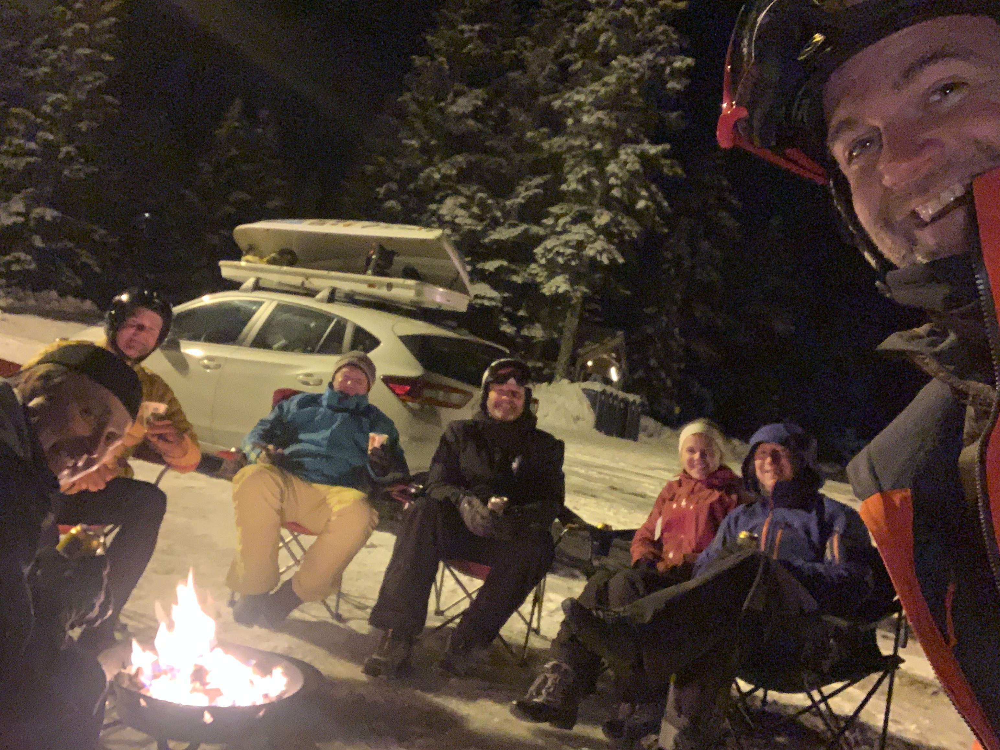
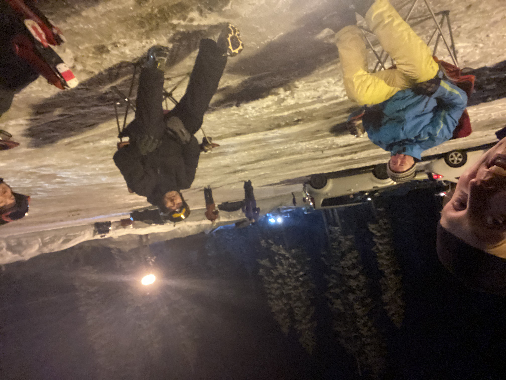
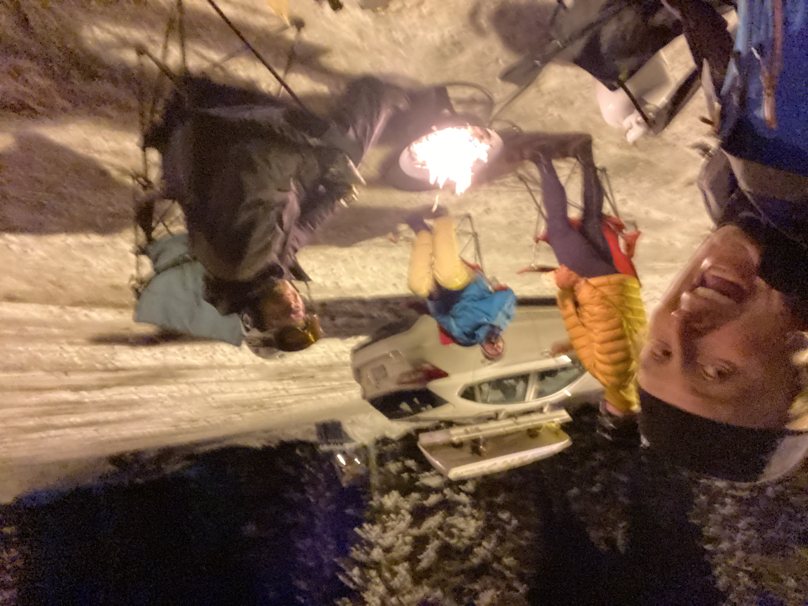

# Photos

## Race 1
  
  

  

# Files

* {{ file.name }}
    - {{ file.modified_time }}
    - {{ file.path }}



# Images (by name)

* {{ image.name }}
    - {{ image.modified_time }}
    - {{ image.path }}


# Images (by date)

* {{ image.basename }}
    - {{ image.modified_time }}
    - {{ image.path }}


# Images (by date reversed)

* {{ image.basename }}
    - {{ image.modified_time }}
    - {{ image.path }}


